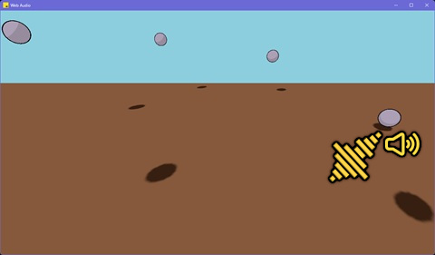

# Node.js 3D WebAudio

This is a part of [Node3D](https://github.com/node-3d) project.

[](https://badge.fury.io/js/3d-webaudio-raub)
[](https://github.com/node-3d/3d-webaudio-raub/actions/workflows/eslint.yml)
[](https://github.com/node-3d/3d-webaudio-raub/actions/workflows/test.yml)

```console
npm i -s 3d-webaudio-raub
```



This plugin injects WebAudio API into Node3D's `window`. It ain't much, but it's honest work.

The WebAudio implementation is provided by [webaudio-raub](https://github.com/node-3d/webaudio-raub).
Some WebAudio features may be missing, but it works with Three.js. With positional audio.

Refer to [webaudio-raub](https://github.com/node-3d/webaudio-raub) for the full list
of currently implemented API.

```typescript
import { init } from '3d-core-raub';
import { init as initWebaudio } from '3d-webaudio-raub';

// Fetch `window` from standard Node3D init
const { window } = init();

// Initialize Webaudio
const { webaudio } = initWebaudio({ window });
// webaudio.AudioContext === window.AudioContext === global.AudioContext
```

Here, `webaudio` is directly re-exported [webaudio-raub](https://github.com/node-3d/webaudio-raub).
You can also use it through `window.AudioContext` or just `AudioContext`. But the main idea is
using it with Three.js, [like this](https://threejs.org/docs/#api/en/audio/PositionalAudio).
